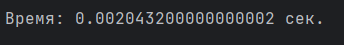
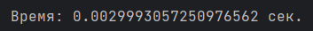

# *Виды сортировок массивов:*

>## 1. **Сортировка пузырьком:**

ОЗУ: Требуется дополнительная память для хранения временных данных (отсортированного массива) и переменных.

ЦП: Наименее эффективная сортировка, так как выполняет сравнения и перестановки для каждого элемента массива, что приводит к высокой нагрузке на ЦП.


<div align="center">



*Рисунок 1 - результат выполнения программы, с использованием сортировки   пузырек*
</div>

 

[Сайт Википедия. Сортировка пузырьком.](https://ru.wikipedia.org/wiki/%D0%A1%D0%BE%D1%80%D1%82%D0%B8%D1%80%D0%BE%D0%B2%D0%BA%D0%B0_%D0%BF%D1%83%D0%B7%D1%8B%D1%80%D1%8C%D0%BA%D0%BE%D0%BC)

Пример кода программы. Сортировка пузырек:
```
from timeit import default_timer as timer
from random import randint
start_time = timer()
N = 100
a = []
for i in range(N):
    a.append(randint(1, 9999))
for i in range(N-1):
    for j in range(N-i-1):
        if a[j] > a[j+1]:
            a[j], a[j+1] = a[j+1], a[j]
print(f"Время: {timer() - start_time} сек.")
```
>## 2. **Сортировка быстрая:**

ОЗУ: Требуется дополнительное пространство для стека вызовов рекурсии, однако оно обычно относительно небольшое.

ЦП: Более эффективна, чем пузырьковая сортировка, благодаря разделению на ча-сти и рекурсивному применению к каждой части. Однако в наихудшем случае может иметь такую же сложность, как и пузырьковая сортировка.


<div align="center">



*Рисунок 2 - результат выполнения программы, с использованием быстрой сортировки*
</div>

 

[Сайт Википедия. Быстрая сортировка.](https://ru.wikipedia.org/wiki/%D0%91%D1%8B%D1%81%D1%82%D1%80%D0%B0%D1%8F_%D1%81%D0%BE%D1%80%D1%82%D0%B8%D1%80%D0%BE%D0%B2%D0%BA%D0%B0)

Пример кода программы. Быстрая сортировка:
```
import random
import time
def quicksort(nums):
    if len(nums) <= 1:
        return nums
    else:
        q = random.choice(nums)
        s_nums = []
        m_nums = []
        e_nums = []
        for n in nums:
            if n < q:
                s_nums.append(n)
            elif n > q:
                m_nums.append(n)
            else:
                e_nums.append(n)
        return quicksort(s_nums) + e_nums + quicksort(m_nums)
start_time = time.time()
nums = [random.randint(1, 1000) for _ in range(1000)]
sorted_nums = quicksort(nums)
end_time = time.time()
v_time = end_time - start_time
print("Время:", v_time, "сек.")

```

>## 3. **Сортировка слиянием:**

ОЗУ: Требуется дополнительное пространство для временного массива, который используется для слияния отсортированных половин.

ЦП: Обычно считается самой эффективной сортировкой, так как она выполняет разделение и слияние рекурсивно.


<div align="center">


*Рисунок 1 - результат выполнения программы, с использованием сортировки слиянием*
</div>

 

[Сайт Википедия. Сортировка слиянием.](https://ru.wikipedia.org/wiki/%D0%A1%D0%BE%D1%80%D1%82%D0%B8%D1%80%D0%BE%D0%B2%D0%BA%D0%B0_%D1%81%D0%BB%D0%B8%D1%8F%D0%BD%D0%B8%D0%B5%D0%BC)

Пример кода программы. Сортировка слиянием:
```
import time
import random
def merge_sort(alist, start, end):
    if end - start > 1:
        mid = (start + end)//2
        merge_sort(alist, start, mid)
        merge_sort(alist, mid, end)
        merge_list(alist, start, mid, end)

def merge_list(alist, start, mid, end):
    left = alist[start:mid]
    right = alist[mid:end]
    k = start
    i = 0
    j = 0
    while (start + i < mid and mid + j < end):
        if (left[i] <= right[j]):
            alist[k] = left[i]
            i = i + 1
        else:
            alist[k] = right[j]
            j = j + 1
        k = k + 1
    if start + i < mid:
        while k < end:
            alist[k] = left[i]
            i = i + 1
            k = k + 1
    else:
        while k < end:
            alist[k] = right[j]
            j = j + 1
            k = k + 1
start_time = time.time()
alist = [random.randint(1, 1000) for _ in range(1000)]
merge_sort(alist, 0, len(alist))
end_time = time.time()
v_time = end_time - start_time
print("Время:", v_time, "сек.")

```


<div align="center">

*Таблица 1 - скорость выполнения программы при использовании разных видов сортировок на разном количестве элементов*


|Алгоритм|100 эл.|10000 эл.|1000000 эл.|
|:-:|:--------:|:---:|:---:|
|Пузырьком|100 мс.|10 с.|3072 с.|
|Быстрая|50 мс.|1 с.|60 с.|
|Слиянием|53 мс.|953 мс.|59 с.|


</div>
Вывод:

1. Быстрая сортировка является компромиссом между потреблением ОЗУ и эффек-тивностью ЦП.
2. Слияние сортировки обычно является лучшим выбором, если производительность является приоритетом.
3. Сортировка пузырьком не рекомендуется для больших наборов данных из-за ее низкой эффективности.

